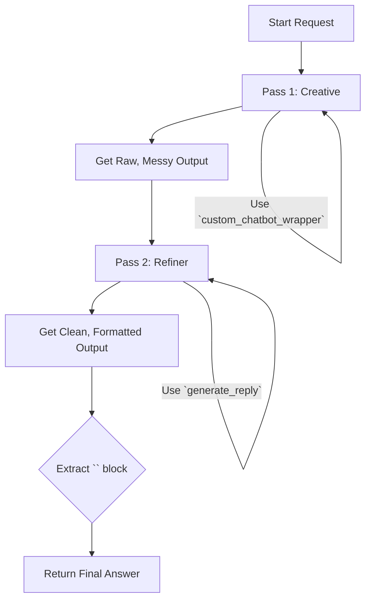

# Final Definitive Plan: Two-Pass Refinement with Correct Tooling

## 1. Objective

To implement a two-pass system that reliably separates creative response generation from strict output formatting by using the correct underlying function for each task.

## 2. The Core Problem

Previous attempts failed because we were using a **conversational** function (`custom_chatbot_wrapper`) for a **text-transformation** task. This caused the AI to "reply to" the text from the first pass instead of "refining" it.

## 3. The Final Architecture: Using the Right Tool for the Job

The two-pass system will be implemented as follows:

### Pass 1: The "Creative" Pass (Conversational)
*   **Function:** `custom_chatbot_wrapper`
*   **Goal:** To generate a rich, in-character response.
*   **Why:** This function is designed for conversation. It correctly handles history, character context, and user input to generate a creative reply.
*   **Output:** A potentially messy raw text that contains the desired response.

### Pass 2: The "Refiner" Pass (Raw Text Completion)
*   **Function:** `generate_reply`
*   **Goal:** To take the raw output from Pass 1 and strictly reformat it.
*   **Why:** This is a lower-level function that performs a direct text completion. It will take the `refiner_prompt` and the messy text from Pass 1 and transform it into the desired clean format without trying to have a conversation.
*   **Output:** A clean response enclosed in `<chatting>` tags.

## 4. Diagram of the Final Flow

## 5. Implementation Steps

1.  **User Approval:** Confirm this final, definitive plan is correct.
2.  **Switch to Code Mode:** Transition to implement the code changes.
3.  **Modify `modules/precise_chat_module.py`:**
    *   Import `generate_reply` from `modules.text_generation`.
    *   The first pass will continue to use `custom_chatbot_wrapper`.
    *   The second pass will be re-written to call `generate_reply`. It will construct a single prompt string containing the `refiner_prompt` and the messy text from Pass 1.
    *   The final parsing logic will operate on the result of `generate_reply`.