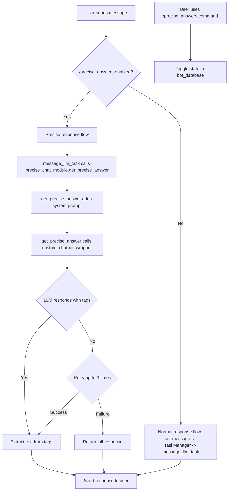

# Plan to Implement `/precise_answers`

This document outlines the plan to implement a new `/precise_answers` command for the Discord bot. This feature will allow users to toggle a mode where the bot provides more direct, "to-the-point" answers by parsing specially formatted output from the LLM.

## 1. Create a new module `precise_chat_module.py`

A new module will be created to contain the core logic for the "precise answers" feature.

-   **File:** `modules/precise_chat_module.py`
-   **Purpose:** This module will be responsible for generating the precisely formatted answer.
-   **Key Function:** A function named `get_precise_answer` will be the main entry point for this module.
    -   It will accept the user's prompt and the current `state` dictionary.
    -   It will inject a system prompt into the context to instruct the LLM to use `<chatting>` tags for its response.
    -   It will call the existing `custom_chatbot_wrapper` to get the raw response from the LLM.
    -   It will parse the LLM's response to find and extract the content within the last pair of `<chatting>...</chatting>` tags.
    -   It will implement a retry mechanism (up to 3 attempts) if the tags are not found in the response. If it fails after all retries, it will return the last full, unparsed response.

## 2. Modify `bot.py` to add the `/precise_answers` command

The main bot file will be updated to include the new user-facing command.

-   **File:** `bot.py`
-   **New Command:** A new hybrid command, `/precise_answers`, will be registered.
-   **Functionality:** This command will act as a toggle (on/off) for the precise answers mode.
-   **State Management:** The state of the toggle will be stored in the `bot_database`. A new dictionary will be added to the database to map a user or channel ID to a boolean value indicating if the mode is active.

## 3. Integrate the Precise Chat Module into the Response Flow

The existing message processing logic will be adapted to incorporate the new module.

-   **File:** `bot.py`
-   **Integration Point:** The `TaskProcessing` class, likely within the `message_llm_task` method, is the ideal place for this integration.
-   **Logic:**
    -   Before generating a response, the code will check the `bot_database` to see if the "precise answers" toggle is enabled for the current user/channel.
    -   If enabled, it will call `get_precise_answer` from `precise_chat_module.py` instead of the standard text generation flow.
    -   The result from `get_precise_answer` will then be sent back to the user.

## 4. Detailed Logic for `precise_chat_module.py`

Here is a more detailed look at the proposed implementation of the `get_precise_answer` function:

```python
# precise_chat_module.py

import re
from modules.utils_tgwui import custom_chatbot_wrapper # And other necessary imports

async def get_precise_answer(text, state, **kwargs):
    """
    Generates a precise answer by instructing the LLM to use <chatting> tags.
    """
    system_prompt = "You must provide your response within <chatting> brackets. For example: <chatting>Your response here.</chatting>"
    
    original_context = state.get('context', '')
    state['context'] = f"{system_prompt}\\n{original_context}"

    for attempt in range(3):
        full_response = ""
        async for response_chunk in custom_chatbot_wrapper(text, state, **kwargs):
            if response_chunk.get('internal'):
                full_response = response_chunk['internal'][-1][1]

        # Ignore anything before </think> if present
        if '</think>' in full_response:
            full_response = full_response.split('</think>')[-1]

        # Find the last <chatting>...</chatting> block
        matches = re.findall(r'<chatting>(.*?)</chatting>', full_response, re.DOTALL)
        if matches:
            return matches[-1].strip()

    # If after 3 attempts no tags are found, return the last full response.
    return full_response
```

## 5. Mermaid Diagram of the Plan

The following diagram illustrates the proposed architecture and flow:



This plan provides a clear path to implementing the desired functionality in a modular and maintainable way.