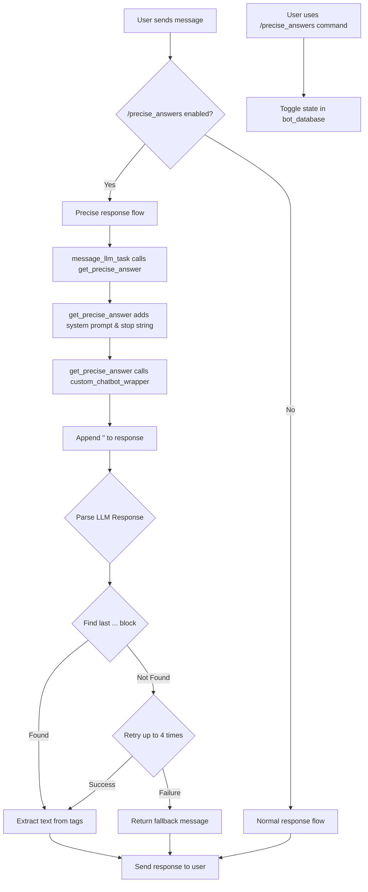

# Plan to Implement `/precise_answers`

This document outlines the plan to implement a new `/precise_answers` command for the Discord bot. This feature will allow users to toggle a mode where the bot provides more direct, "to-the-point" answers by parsing specially formatted output from the LLM.

## 1. Create a new module `precise_chat_module.py`

A new module will be created to contain the core logic for the "precise answers" feature.

-   **File:** `modules/precise_chat_module.py`
-   **Purpose:** This module will be responsible for generating the precisely formatted answer.
-   **Key Function:** A function named `get_precise_answer` will be the main entry point for this module.
    -   It will accept the user's prompt and the current `state` dictionary.
    -   It will inject a system prompt into the context to instruct the LLM to formulate a response, use `<thinking>` tags for internal thoughts, and wrap the final reply in `<chatting>` tags.
    -   It will dynamically add `</chatting>` as a stopping string to the API call to prevent the model from generating extra text after the response.
    -   It will make a single call to the `custom_chatbot_wrapper` to get the raw response from the LLM.
    -   It will append the `</chatting>` tag to the raw response to ensure the block is complete, as using it as a stop string removes it from the output.
    -   It will parse the LLM's response by finding the last `</chatting>` tag and working backward to find its corresponding `<chatting>` tag, reliably extracting the content.
    -   It will implement a retry mechanism (up to 4 attempts) if the tags are not found in the response. If it fails after all retries, it will return a fallback message.

## 2. Modify `bot.py` to add the `/precise_answers` command

The main bot file will be updated to include the new user-facing command.

-   **File:** `bot.py`
-   **New Command:** A new hybrid command, `/precise_answers`, will be registered.
-   **Functionality:** This command will act as a toggle (on/off) for the precise answers mode.
-   **State Management:** The state of the toggle will be stored in the `bot_database`. A new dictionary will be added to the database to map a user or channel ID to a boolean value indicating if the mode is active.

## 3. Integrate the Precise Chat Module into the Response Flow

The existing message processing logic will be adapted to incorporate the new module.

-   **File:** `bot.py`
-   **Integration Point:** The `TaskProcessing` class, likely within the `message_llm_task` method, is the ideal place for this integration.
-   **Logic:**
    -   Before generating a response, the code will check the `bot_database` to see if the "precise answers" toggle is enabled for the current user/channel.
    -   If enabled, it will call `get_precise_answer` from `precise_chat_module.py` instead of the standard text generation flow.
    -   The result from `get_precise_answer` will then be sent back to the user.

## 4. Detailed Logic for `precise_chat_module.py`

Here is a more detailed look at the simplified implementation of the `get_precise_answer` function:

```python
# ad_discordbot/modules/precise_chat_module.py

async def get_precise_answer(text, state, **kwargs):
    """
    Generates a precise, in-character answer by making a single call to the LLM,
    instructing it to use <chatting> tags. Retries up to 4 times.
    """
    state['skip_html_escape'] = True

    system_prompt = (
        "You are an AI character. Your goal is to provide an in-character response. "
        "You can think to yourself using <thinking>...</thinking> tags, but this will be hidden from the user. "
        "Your final, user-visible response MUST be enclosed in a single <chatting>...</chatting> block. "
        "For example: <thinking>I should respond politely.</thinking><chatting>Hello there! How can I help you?</chatting>"
    )

    max_retries = 4
    attempts_list = []
    original_context = state.get('context', '')

    for attempt in range(max_retries):
        # Use a deepcopy of the state to avoid polluting the main history with system prompts.
        state_copy = copy.deepcopy(state)
        state_copy['context'] = f"{system_prompt}\n{original_context}"

        # Dynamically add '</chatting>' to the stopping strings to prevent the model from looping.
        stopping_strings = state_copy.get('stopping_strings', [])
        if '</chatting>' not in stopping_strings:
            stopping_strings.append('</chatting>')
        state_copy['stopping_strings'] = stopping_strings

        # Use the same async execution pattern as the original creative pass
        llm_func = partial(custom_chatbot_wrapper, text=text, state=state_copy, **kwargs)
        llm_generator = generate_in_executor(llm_func)

        full_response = ""
        async for response_chunk in llm_generator:
            if response_chunk.get('internal') and isinstance(response_chunk['internal'], list) and len(response_chunk['internal']) > 0:
                full_response = response_chunk['internal'][-1][1]

        # If we used '</chatting>' as a stop string, the model output will likely be missing it.
        # We add it back before parsing to ensure the block is complete.
        full_response += '</chatting>'

        attempts_list.append({"raw_output": full_response})

        # --- PARSING ---
        # Find the last occurrence of </chatting> and work backwards to find the start.
        # This is more robust than regex or multi-step parsing.
        end_chat_pos = full_response.rfind('</chatting>')
        if end_chat_pos != -1:
            start_chat_pos = full_response.rfind('<chatting>', 0, end_chat_pos)
            if start_chat_pos != -1:
                final_answer = full_response[start_chat_pos + len('<chatting>'):end_chat_pos].strip()
                log_precise_entry(text, attempts_list, final_answer, f"from attempt {attempt + 1}")
                return final_answer

        # If no match, wait before retrying
        if attempt < max_retries - 1:
            await asyncio.sleep(1)

    # Fallback if all retries fail
    final_fallback_response = "I am sorry, I am having trouble formulating a response."
    log_precise_entry(text, attempts_list, final_fallback_response, f"fallback after {max_retries} retries")
    return final_fallback_response
```

## 5. Mermaid Diagram of the Plan

The following diagram illustrates the proposed architecture and flow:



This plan provides a clear path to implementing the desired functionality in a modular and maintainable way.