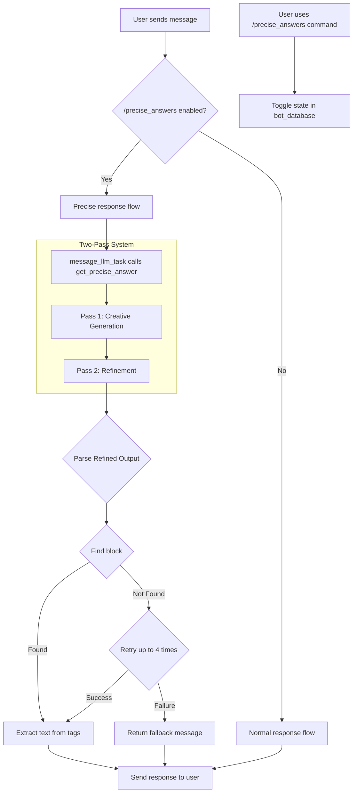

# Plan to Implement `/precise_answers`

This document outlines the plan to implement a new `/precise_answers` command for the Discord bot. This feature will allow users to toggle a mode where the bot provides more direct, "to-the-point" answers by parsing specially formatted output from the LLM.

## 1. Create a new module `precise_chat_module.py`

A new module will be created to contain the core logic for the "precise answers" feature.

-   **File:** `modules/precise_chat_module.py`
-   **Purpose:** This module will be responsible for generating the precisely formatted answer.
-   **Key Function:** A function named `get_precise_answer` will be the main entry point for this module.
    -   It will accept the user's prompt and the current `state` dictionary.
    -   It will use a two-pass architecture:
        1.  **Creative Pass:** Generate an in-character response using the `custom_chatbot_wrapper`.
        2.  **Refiner Pass:** Take the output from the creative pass and use a second, raw `generate_reply` call with strict, non-creative parameters to enclose it in `<chatting>` tags.
    -   It will parse the output of the refiner pass to extract the final, clean response.
    -   It will implement a retry mechanism (up to 4 attempts) if the tags are not found in the response. If it fails after all retries, it will return a fallback message.

## 2. Modify `bot.py` to add the `/precise_answers` command

The main bot file will be updated to include the new user-facing command.

-   **File:** `bot.py`
-   **New Command:** A new hybrid command, `/precise_answers`, will be registered.
-   **Functionality:** This command will act as a toggle (on/off) for the precise answers mode.
-   **State Management:** The state of the toggle will be stored in the `bot_database`. A new dictionary will be added to the database to map a user or channel ID to a boolean value indicating if the mode is active.

## 3. Integrate the Precise Chat Module into the Response Flow

The existing message processing logic will be adapted to incorporate the new module.

-   **File:** `bot.py`
-   **Integration Point:** The `TaskProcessing` class, likely within the `message_llm_task` method, is the ideal place for this integration.
-   **Logic:**
    -   Before generating a response, the code will check the `bot_database` to see if the "precise answers" toggle is enabled for the current user/channel.
    -   If enabled, it will call `get_precise_answer` from `precise_chat_module.py` instead of the standard text generation flow.
    -   The result from `get_precise_answer` will then be sent back to the user.

## 4. Detailed Logic for `precise_chat_module.py`

Here is a more detailed look at the simplified implementation of the `get_precise_answer` function:

```python
# ad_discordbot/modules/precise_chat_module.py
import re
import asyncio
from functools import partial
import copy
from modules.utils_tgwui import custom_chatbot_wrapper
from modules.text_generation import generate_reply
from modules.utils_asyncio import generate_in_executor
import os
from datetime import datetime

async def get_precise_answer(text, state, **kwargs):
    """
    Generates a precise answer using a two-pass refinement architecture.
    1. Creative Pass: Generates a rich, in-character response.
    2. Refiner Pass: Cleans and formats the response from Pass 1.
    """
    state['skip_html_escape'] = True

    refiner_prompt_template = "Enclose the following text in <chatting> tags: {creative_output}"

    max_retries = 4
    attempts_list = []

    for attempt in range(max_retries):
        # --- PASS 1: CREATIVE ---
        # Use a deepcopy of the state to avoid polluting the main history.
        creative_state = copy.deepcopy(state)

        creative_func = partial(custom_chatbot_wrapper, text=text, state=creative_state, **kwargs)
        creative_generator = generate_in_executor(creative_func)
        pass1_raw_output = ""
        async for response_chunk in creative_generator:
            if response_chunk.get('internal') and isinstance(response_chunk['internal'], list) and len(response_chunk['internal']) > 0:
                pass1_raw_output = response_chunk['internal'][-1][1]

        # --- PASS 2: REFINER ---
        # Use a separate, non-creative state for the refiner pass.
        refiner_state = {
            'max_new_tokens': len(pass1_raw_output) + 50, # Allow enough tokens for tags and minor variance
            'temperature': 0.01,
            'top_p': 0.1,
            'top_k': 1,
            'repetition_penalty': 1.0,
            'stopping_strings': ['</chatting>']
        }
        refiner_prompt_text = refiner_prompt_template.format(creative_output=pass1_raw_output)
        
        # Use the low-level generate_reply for raw text completion
        pass2_refined_output = ""
        reply_generator = generate_reply(refiner_prompt_text, refiner_state, is_chat=False)
        for reply in reply_generator:
            pass2_refined_output = reply
        
        # Add the closing tag back if it was used as a stop string
        if not pass2_refined_output.endswith('</chatting>'):
            pass2_refined_output += '</chatting>'

        attempts_list.append({
            "pass1_creative_output": pass1_raw_output,
            "pass2_refined_output": pass2_refined_output
        })

        # --- FINAL EXTRACTION ---
        matches = re.findall(r'<chatting>(.*?)</chatting>', pass2_refined_output, re.DOTALL)
        if matches:
            final_answer = matches[-1].strip()
            log_precise_entry(text, attempts_list, final_answer, f"from attempt {attempt + 1}")
            return final_answer

        if attempt < max_retries - 1:
            await asyncio.sleep(1)

    # Fallback if all retries fail
    final_fallback_response = "I am sorry, I am having trouble formulating a response."
    log_precise_entry(text, attempts_list, final_fallback_response, f"fallback after {max_retries} retries")
    return final_fallback_response
```

## 5. Mermaid Diagram of the Plan

The following diagram illustrates the proposed architecture and flow:



This plan provides a clear path to implementing the desired functionality in a modular and maintainable way.